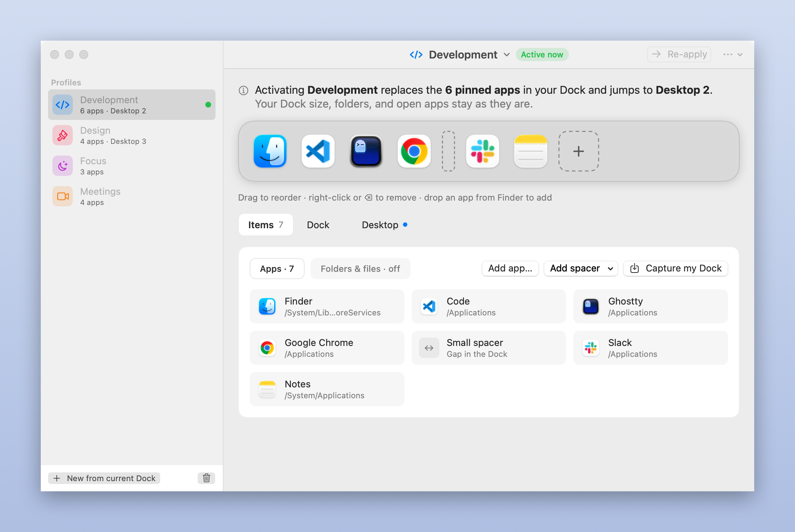
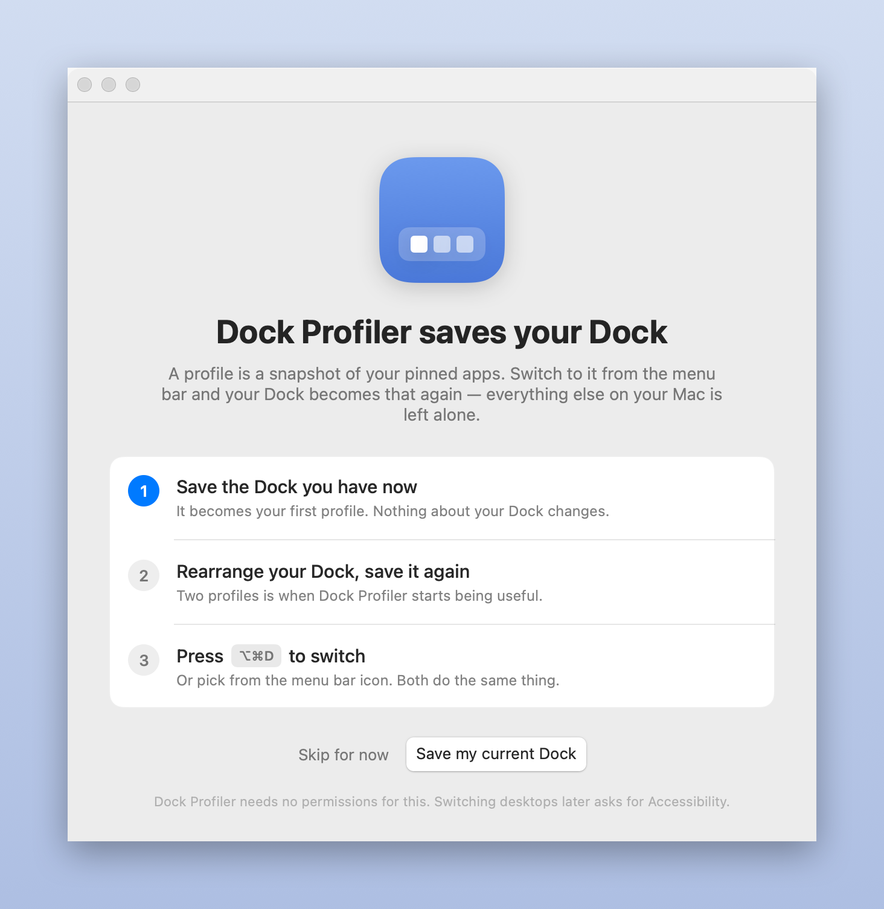
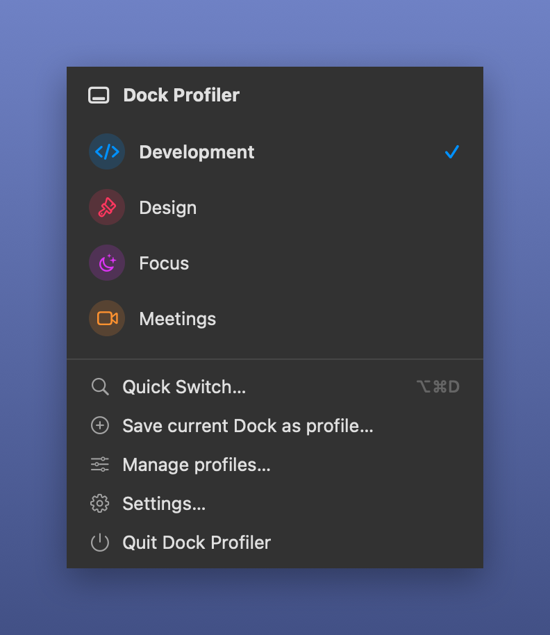
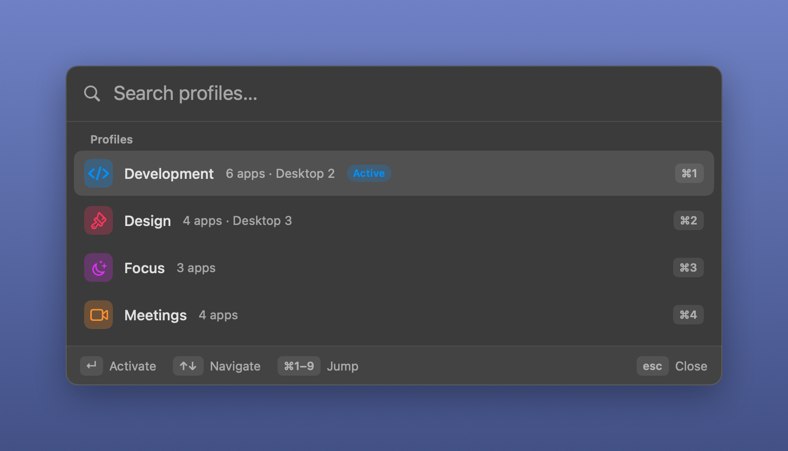

# Dock Profiler

A macOS app for **Dock profiles** — save a Dock layout, switch to it in one
click — with an optional **wallpaper** attached to each profile, set on the desktop you
are on when you activate it.

Everything is local. No account, no sync, no analytics.



## Install

With [Homebrew](https://brew.sh):

```bash
brew install --cask estruyf/tap/dock-profiler
```

Or download the disk image from the [latest release](../../releases/latest) and drag
Dock Profiler to Applications. The build is universal (Apple Silicon and Intel), signed
and notarized.

## Requirements

macOS 14 or later. Building it needs a Swift 6 toolchain (Xcode 16).

## Build & run

```sh
npm run build:debug   # quick local build, current architecture
npm run open
```

Either call `./Scripts/build_app.sh` directly, or through the `npm` scripts that wrap
it — same build either way:

| `npm run` | What it does |
| --- | --- |
| `build:debug` | Quick build, current architecture only |
| `build` | Universal build (`arm64` + `x86_64`), ad-hoc signed |
| `build:install` | Universal build, copied to /Applications and launched |
| `build:zip` / `build:dmg` | Universal build, also zipped / made into a disk image |
| `sign` | Zipped, signed with the Developer ID `CODESIGN_IDENTITY` finds |
| `notarize` | Signed, notarized and stapled — needs a stored `xcrun notarytool` profile |
| `release` | `notarize`, plus a disk image — what CI runs |
| `open` / `quit` | Launch / quit the built app |
| `screenshots` | Regenerate `docs/screenshots` (see below) |
| `clean` | Remove `.build` and `build` |

`./Scripts/build_app.sh` on its own produces a universal, ad-hoc signed build in
`build/`. See the header of the script for signing and notarization details.

The app is a menu bar item (`LSUIElement`), so it has no Dock icon. The profile manager
opens from the menu bar, or by opening the app again from Finder. Settings lives in that
window too, as the last row of the sidebar — from the menu bar panel, `Settings…` opens
the manager on it, and `⌘,` selects it while the window has focus.

## First run



One screen, one button: Dock Profiler offers to save the Dock you already have as your
first profile. Skipping is fine — nothing about your Dock changes either way. It can be
reopened from Settings → General → Welcome screen, or with `open "dockprofiler://welcome"`.

## Switching profiles

Three ways, all doing the same thing:

* **Menu bar** — click the Dock Profiler icon and pick a profile.

  
* **Quick switcher** — press the global shortcut (**⌥⌘D** out of the box) anywhere and a
  Spotlight-style window opens: type a few letters, `↑`/`↓` or `⇥` to move, `↵` to
  activate, `⌘1`–`⌘9` to jump straight to one, `esc` to close. It closes as soon as it
  loses focus, appears on whichever desktop you are on, and follows the mouse to the
  display you are working on.

  
  Change or clear the shortcut in Settings → Quick switcher. It is registered through
  Carbon's `RegisterEventHotKey`, so it needs no Accessibility access; if another app
  already owns the combination, Settings says so.
* **URL scheme** — for Raycast, Alfred, Shortcuts, Keyboard Maestro or a shell script:

  ```sh
  open "dockprofiler://switch"                    # toggle the quick switcher
  open "dockprofiler://profiles"                  # open the profile manager
  open "dockprofiler://activate?name=Development" # activate a profile by name
  open "dockprofiler://activate?id=<uuid>"        # …or by id
  ```

  macOS only knows about the scheme once it has registered the bundle. Launching the app
  once is normally enough; if not, `lsregister -f "build/Dock Profiler.app"` forces it.

## What a profile holds

| Part | What happens on activation |
| --- | --- |
| Pinned apps and spacers | Replaces `persistent-apps` in `com.apple.dock` |
| Folders, files, stacks *(optional)* | Replaces `persistent-others` — off by default, so that side of the Dock is left alone |
| Dock appearance *(optional)* | Position, size, magnification, auto-hide, recents, minimize-into-icon |
| Desktop wallpaper *(optional)* | Sets the desktop picture on the desktop you are on |
| Custom dock *(optional)* | Shows Dock Profiler's own dock — apps and widgets together, or a strip of widgets on its own — on any edge, with optional auto-hide |

Spacers come in two sizes, regular and small. Flexible spacers are not offered — macOS
does not apply them reliably — though one already in a captured Dock is preserved as-is.

The editor puts your Dock on screen as a Dock: drag the icons to reorder, drop an app in
from Finder to add, right-click or press ⌫ to remove. Underneath, four tabs — **Items**,
**Dock**, **Custom Dock**, **Desktop** — carry a dot when that part of the profile is switched on, and a
sentence at the top spells out exactly what activating it will do and what it leaves
alone.

Only pinned items change. Running apps, minimized windows and every Dock setting the
profile does not claim stay exactly as they are.

### Auto-save

The profile you last activated tracks the Dock: drag an app in or out and the profile is
updated to match. Turn it off in Settings → Active profile.

## The wallpaper

A profile can carry a wallpaper, set when the profile is activated. `NSWorkspace` sets
the picture for whichever Space is on screen at that moment, so the wallpaper lands on
the desktop you are on — which is how "the development desktop" ends up looking
different from the others. Optionally on every display, or just the main one.

## The custom dock

The macOS Dock has no extension point: `persistent-apps` only takes apps, folders, links
and spacers, so nothing live can be pinned to it. A profile can instead carry a **custom
dock** that Dock Profiler draws itself, in a borderless panel that never takes focus,
follows you across Spaces, and sits below the Dock's own window level so an auto-hidden
macOS Dock still slides in over it. It comes in two forms:

- **Apps and widgets** — one dock holding the profile's apps and its widgets, in the
  order you arrange them in the editor's preview, standing in for the macOS Dock. App
  tiles launch or bring an app forward, carry the running dot, and offer Hide, Quit and
  Show in Finder on right-click. Optionally, apps that are open but not in the profile
  follow after a divider, as the Dock does. While such a profile is active the macOS
  Dock is parked — auto-hidden with a delay so long it never comes back on hover (⌘⌥D
  still toggles it). Its own settings come back with the next profile that neither
  stands in for it nor manages Dock settings itself, and when Dock Profiler quits.
- **Widgets only** — a strip of widgets beside the macOS Dock.

Either form goes on any edge: bottom or top, hugging the left, centre or right; or left
or right, centred on the edge and stacked as a column with the dots beside the icons.
In a column every widget becomes a tile the size of an icon and re-flows to fit —
the battery's percentage moves under its icon, each agent session becomes a dot over
its folder name — and hovering any tile shows the dock's own tooltip with the detail.
A **size** slider (36–96 pt) scales icons, cards and type together, and **magnification**
grows the tiles under the pointer, pushing their neighbours aside, as the Dock does. A
**look** picks the slab: following the system, as the Dock does; light or dark
whatever the system appearance — tiles, tips and stacks follow the slab; on macOS
Tahoe, **Liquid Glass**, refracting what is behind it; or **transparent**, no slab at
all, each widget on its own card. Those two read the wallpaper under the dock and go
light or dark to suit it, as the Tahoe Dock does. The slab can blur what is behind it or be drawn
solid — clear, for Liquid Glass — and is solid regardless while macOS's Reduce
transparency is on. It can take a wash of
the profile's colour, so each profile's dock is its own. Widgets can lose their cards
for a flatter look, and a **density** picks how tightly the tiles are packed, the
corners squaring off as it tightens. **Hide until the
pointer reaches its edge** slides it off screen and brings it back when the pointer runs
into the edge where it lives — polling the pointer position, so no Accessibility
permission. While it is away, a slim mark stays on the edge where it went, so you
know something is there to open; it brightens a little as the pointer heads its way.
Turn that off if you would rather have the edge to yourself.

Widgets keep their place among the apps by anchoring to the app before them rather than
to a position, so when the Dock is rearranged underneath the profile (auto-save replaces
the app list wholesale) each widget stays next to the app it followed.

In Mission Control a combined dock stays on screen in place of the macOS Dock — drawn
just above the Dock's own window level, the one Mission Control does not hide. Mission
Control still draws the parked macOS Dock underneath; there is no API to stop it, but
the custom dock sits in front of it.

The dock follows the active profile: activate one with a custom dock and it appears,
activate one without and it goes away, edit the active profile and it updates as you go.
It can also be rearranged in place, the Dock's way: hold a tile or widget for a moment,
drag it along the dock and let go — the profile is updated as you drop.

### Widgets

- **Clock**, **Date**, **Battery** — the glanceable ones.
- **Now Playing** — the track in Music or Spotify, with its album art. Click to play
  or pause; skip from the context menu, or turn on previous/next buttons on its card.
- **Profiles** — the active profile; click for the list and switch without going to
  the menu bar.
- **Trash** — full or empty. Click to open it, drop files on it to delete them, empty
  it from the context menu. Handy in a combined dock, which stands in for the Dock's own.
- **AirDrop** — drop files on it and the AirDrop picker opens with them, so sending
  something to the phone is one drag. Click it for Finder's AirDrop window.
- **Folder** — a folder that opens into its most recent files, newest first, like a
  Dock stack. Downloads by default; choose any folder on its card in the editor.
- **App Stack** — several apps folded into one tile, a grid of their icons, that opens
  into the apps. Add apps on its card or drop them from Finder.
- **Agents** — see below. It can also fold into one tile with a count that opens into
  the list.
- **AI Usage** — what is left of your Claude and GitHub Copilot allowances, a card per
  service, as numbers, rings or bars. See below.

Stacks open in a panel beside the dock, on the side away from its edge, that goes away
on a click anywhere else — and, like the dock, never takes focus from the front app.

### The Agents widget

If you use [Agent Frame](https://github.com/estruyf/vscode-agent-frame) in VS Code, the
**Agents** widget shows a card per Claude Code session — folder, and whether it is
working, waiting for you, or idle, in Agent Frame's own colours, the ones that need you
first. It reads the session files Agent Frame's hooks keep in `~/.agent-frame/sessions`,
so there is nothing extra to set up. Beyond four sessions the rest fold into a menu.

Click a card to bring that session's editor forward. The hook records the agent's
process, and walking up from it reaches the app hosting the session — VS Code, Insiders,
Cursor — so the folder is opened with that app, which focuses the window that already
has it.

### The AI Usage widget

The **AI Usage** widget shows how much of your **Claude** and **GitHub Copilot**
allowances is left — one card per service, drawn as numbers, rings or bars (pick on its
card in the editor, along with which services to track). Each card shows the tightest
of the service's main windows: Claude's 5-hour and weekly limits, Copilot's premium
requests for the month. Blue while there is plenty, orange under a quarter, red under a
tenth. Click a card for every window with its reset time and countdown — Claude's
per-model weekly limits included — and refresh or jump to the service's usage page from
the context menu. The numbers refresh every five minutes while the widget is on screen,
and when the Mac wakes.

There is nothing to sign in to: the widget reads the sign-in each service's own tools
leave on your Mac.

- **Claude** — Claude Code's OAuth token, from the `Claude Code-credentials` item in
  your Keychain (or `~/.claude/.credentials.json`), sent to Anthropic's OAuth usage
  endpoint. The token is only read, never refreshed — refreshing it from outside would
  sign Claude Code out. If it has expired, the card says so; run `claude` once and it
  comes back. Reading the item brings up macOS's Keychain dialog the first time; **Always
  Allow** settles it for that build of the app.
- **Copilot** — the GitHub token the Copilot extensions for VS Code and Xcode keep in
  `~/.config/github-copilot/apps.json`, sent to the endpoint those editors ask for the
  same numbers (`copilot_internal/user`). Sign in to Copilot in either editor and the
  card fills in.

Switching Spaces is not part of a profile. macOS has no public API for it, so it would
mean posting `Control + ←/→` keystrokes and asking for Accessibility access — a
permission for something the Dock profile itself never needed.

## Permissions

Dock Profiler asks for **no privacy permissions** for what it does itself. It reads and
writes `com.apple.dock`, sets the desktop picture through `NSWorkspace`, and registers
its shortcut through Carbon hot keys — none of which need Accessibility, Screen Recording
or Automation access. Two widgets talk to other apps, and macOS asks about those the
first time they do.

| Permission | Needed for | Prompted |
| --- | --- | --- |
| *(none)* | Dock profiles, wallpaper, most widgets | Nothing to grant |
| *(none)* | The global shortcut | Carbon hot keys need no permission |
| Automation → Music / Spotify | Now Playing's first read and its play, pause and skip; track changes themselves arrive over notifications that need nothing | Once, when the widget first asks the player |
| Automation → Finder | Empty Trash from the Trash widget | Once, the first time you empty it |
| Files and Folders | The Trash widget counting what is in the Trash; the Folder widget reading a protected folder such as Downloads | Once per folder |
| Keychain | The AI Usage widget reading Claude Code's token from the `Claude Code-credentials` item | Once per build, with Always Allow |
| Login item | Launch at login | Settings toggle (`SMAppService`) |

## Layout

```
Sources/DockProfiler/
  DockProfilerApp.swift          MenuBarExtra + Settings scenes, app delegate
  Models/DockTile.swift      One Dock item; keeps the Dock's own tile dictionary verbatim
  Models/DockProfile.swift   Profile, appearance and wallpaper options
  Models/CustomDock.swift    Widget kinds, the custom dock's options, and the mixed row
  Services/DockService.swift Reads/writes com.apple.dock, restarts the Dock
  Services/WallpaperService.swift  Sets the desktop picture
  Services/BatteryMonitor.swift    IOKit power source, for the battery widget
  Services/AgentSessionMonitor.swift  Agent Frame's session files, for the agents widget
  Services/NowPlayingMonitor.swift    Music and Spotify, for the now-playing widget
  Services/TrashMonitor.swift         ~/.Trash, for the trash widget
  Services/AIUsageMonitor.swift       Claude and Copilot allowances, for the AI usage widget
  Services/AppleScriptRunner.swift    AppleScript in an osascript child, off the main thread
  Services/RunningAppsMonitor.swift   Running apps, for the custom dock's dots
  Services/ProfileStore.swift  Profiles, activation, JSON persistence
  Services/DockWatcher.swift   Notices Dock changes for auto-save
  Services/AppSettings.swift   Preferences + login item
  Services/HotKeyManager.swift Carbon global shortcut
  Services/KeyCombo.swift      A recorded shortcut, in Carbon's terms
  UI/                        Menu bar panel, quick switcher, welcome, manager window, editor, settings
  UI/CustomDockWindowController.swift  The floating custom dock, following the active profile
  UI/DockTooltip.swift                 The dock's own hover tips
  UI/DockStack.swift                   The panel a stack widget opens into
  UI/DockWidgets.swift                 Now playing, profiles, trash, folder and app stacks, AI usage
```

Profiles live in `~/Library/Application Support/Dock Profiler/profiles.json`. Each item keeps
the Dock's original tile dictionary (bookmark data, labels, `dock-extra`, …) so a
captured Dock is restored exactly, not approximated.

## Not included

**Focus mode integration.** macOS exposes no supported way to observe the active Focus,
so profiles are switched by hand, by the menu bar, or by whatever you script around them.

What changed per version is in the [changelog](./CHANGELOG.md).

## Releasing

`.github/workflows/release.yml` builds, signs, notarizes and staples on a `macos-15`
runner, then attaches a zip and a disk image to the release.

1. Add an entry to `CHANGELOG.md`, under a new `## [<version>] - <date>` heading.
2. Bump the version with `npm version patch` (or `minor` / `major`). This updates
   `package.json` — the only place the version lives — and commits and tags it as
   `v<version>`, npm's default tag format.
3. `git push --follow-tags`.
4. Publish a GitHub release for that tag.

The tag and `package.json` have to agree, or the workflow stops before building — that
guard is what makes `npm version` the source of truth rather than an editor typo.

The workflow also runs from *Actions → Release → Run workflow*, where a `tag` input
attaches the build to an existing release — useful when a release's build failed and you
would rather repair it than cut a new one.

These repository secrets are needed for a signed build:

| Secret | What it is |
| --- | --- |
| `MACOS_CERTIFICATE` | Developer ID Application certificate, exported as `.p12` and base64-encoded |
| `APPLE_ID` | The Apple ID used for notarization |
| `APPLE_TEAM_ID` | Your team identifier |
| `APPLE_APP_PASSWORD` | An app-specific password for that Apple ID |
| `HOMEBREW_TAP_TOKEN` | A token with write access to `estruyf/homebrew-tap`, for the step below |

Without `MACOS_CERTIFICATE` the run still finishes, producing an unsigned build — enough
to check that a tag compiles, not enough to hand to anyone. Nothing unsigned is ever
attached to the release or pushed to the tap; the workflow warns and stops at those
steps instead.

## The Homebrew tap

A published, non-prerelease, signed release also updates `estruyf/homebrew-tap`, so
`brew install --cask estruyf/tap/dock-profiler` resolves to it. `homebrew/dock-profiler.rb`
in this repo is the source of truth — everything in it except `version` and `sha256` is
edited here by hand, and `homebrew/publish-cask.sh` stamps those two fields and pushes
the result to the tap. Run it yourself with `HOMEBREW_TAP_TOKEN` unset to fall back to
your own `git`/`gh` credentials:

```sh
./homebrew/publish-cask.sh          # stamp the cask and print it
./homebrew/publish-cask.sh --push   # also push it to the tap
```

## Screenshots

`./Scripts/make_screenshots.sh` regenerates everything in `docs/screenshots` from the
real views, using demo profiles written to a throwaway store. Your own profiles are
never read or touched.

## Restoring your Dock

Dock Profiler never deletes anything, but if you want to go back to a known state:

```sh
defaults import com.apple.dock path/to/com.apple.dock.plist && killall Dock
```
