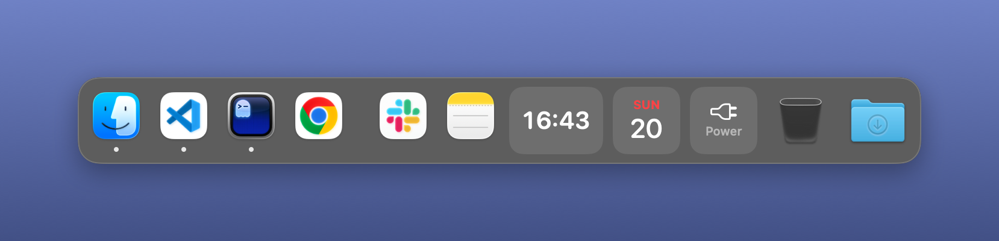
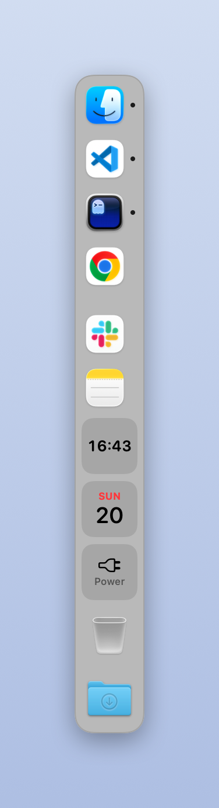

# The custom dock

A profile can carry a dock that Dock Profiler draws itself, so live things — a clock,
what is playing, your battery, your AI allowances, the agents working in your editors —
can sit next to your apps. The macOS Dock has no extension point for that, so this is a
separate floating panel. It never takes focus, follows you across Spaces, and stays out
of the way of the real Dock. (Why it is built that way is in
[How it works](./how-it-works.md#the-custom-docks-window).)

Turn it on in the profile editor's **Custom Dock** tab, which holds the dock itself —
where it sits, how it looks. Its widgets have a tab of their own, **Widgets**, next to
it. The dock follows the active profile: activate one with a custom dock and it
appears, activate one without and it goes away, edit the active profile and it updates
as you go.

## Two forms

- **Apps and widgets** — one dock holding the profile's apps and its widgets, in the
  order you arrange them in the editor's preview, standing in for the macOS Dock. App
  tiles launch or bring an app forward, carry the running dot, and on right-click
  offer Remove from Dock and the dock's settings first, then the Dock's own menu: the
  app's open windows — across every instance, a check mark on the one in front, a
  diamond on a minimized one; pick one and it comes forward — then the app's own
  **New Window** (New Finder Window, New Viewer Window — whatever its File menu calls
  it) for a running app that has one, then, on VS Code, its **Recent Projects** and,
  on a browser, its **Profiles** (both below), then Options (Keep in Dock, Show in
  Finder), Show All Windows, Hide and Quit. The window list and the New Window item
  are read through Accessibility (see [Permissions](./permissions.md)); without it the
  menu has an item that leads there. Recent documents are the one thing the Dock's
  menu has and this one cannot — VS Code's projects aside, macOS hands an app's list
  to that app alone. Hold a tile — an app or a widget — and drag
  it off the dock to remove it, as in the Dock; widgets offer Remove from Dock on
  right-click too. Optionally, apps that are open but not in the profile follow after
  a divider, as the Dock does — hold one and drag it across the divider to keep it in
  the profile, or choose Keep in Dock, also as the Dock does — and the tiles carry the
  Dock's notification badges — WhatsApp's unread count, Mail's — which takes
  Accessibility access too. While such a profile is active the macOS
  Dock is parked out of the way (⌘⌥D still toggles it); it comes back with the next
  profile that does not stand in for it, and when Dock Profiler quits.
- **Widgets only** — a strip of widgets beside the macOS Dock, which keeps doing its
  job.

## Position

Either form goes on any edge: bottom or top, hugging the left, centre or right; or left
or right, centred on the edge and stacked as a column with the dots beside the icons.
In a column every widget becomes a tile the size of an icon and re-flows to fit — the
battery's percentage moves under its icon, each agent session becomes a dot over its
folder name — and hovering any tile shows the dock's own tooltip with the detail.

**Displays** puts the dock on the main display alone or on every display, each with a
dock of its own. Any display can be given an edge and alignment of its own on its row
underneath, so two displays side by side can keep their docks on the outer edges and
leave the edge between them clear for the pointer.

**Showing** picks how the dock comes and goes. **Always visible** keeps it on screen
for as long as the profile is active. **Hide automatically** slides it off screen and
brings it back when the pointer runs into the edge where it lives; while it is away, a
slim mark stays on the edge where it went, so you know something is there to open, and
it brightens a little as the pointer heads its way — turn that off if you would rather
have the edge to yourself. **Pill on the edge** hides it too, but leaves a small pill
there and opens the dock only when the pointer reaches the pill itself, so the rest of
that edge stays yours.

**Sits** is where the slab meets the screen. **Floating** leaves it a little off the
edge, rounded all round, as it has always been drawn. **Joined to the edge** runs it
into the edge with the corners there squared off, the way the menu bar meets the top of
the screen. Liquid Glass keeps its corners rounded either way: it shapes itself from a
radius alone.

## Look

- A **size** slider (36–96 pt) scales icons, cards and type together.
- **Magnification** grows the tiles under the pointer, pushing their neighbours aside,
  as the Dock does.
- The dock never grows past the screen. A dock with more on it than fits stops at the
  screen's edge and pages instead: arrows at its end move through the rest, a page at
  a time, and a scroll of the wheel or trackpad over it does the same. A slim **grip**
  at the same end sets a limit of your own — drag it along the edge and the dock stops
  there, paging past it. Drag it out to where everything fits again, or double-click
  it, and the limit is lifted; **Maximum width** in the Size section shows it, with a
  button to lift it from there. The grip and the arrows sit at the end of the dock
  that is free to move: the right end, or the left when the dock hugs the right edge
  of the screen; the bottom end of a column.
- A **look** picks the slab: following the system, as the Dock does; light or dark
  whatever the system appearance — tiles, tips and stacks follow the slab; on macOS
  Tahoe, **Liquid Glass**, refracting what is behind it; or **transparent**, no slab at
  all, each widget on its own card. Those two read the wallpaper under the dock and go
  light or dark to suit it, as the Tahoe Dock does.
- The slab can blur what is behind it or be drawn solid — clear, for Liquid Glass —
  and is solid regardless while macOS's Reduce transparency is on.
- It can take a wash of the profile's colour, so each profile's dock is its own.
- Widgets can lose their cards for a flatter look.
- **Open a widget's card when the pointer rests on it** brings out the card a click
  opens — a stack's files, the agent sessions, a service's usage — after a moment of
  hovering, and takes it away again when the pointer leaves both the widget and the
  card. A click still opens it at once, and pins it so it stays.
- A **density** picks how tightly the tiles are packed, the corners squaring off as it
  tightens.

## Rearranging

Arrange apps and widgets in the editor's preview, or in place, the Dock's way: hold a
tile or widget for a moment, drag it along the dock and let go — the profile is updated
as you drop. Widgets keep their place next to the app they follow, so auto-save
rearranging the app list underneath does not scatter them.

### Browser profiles

Right-click a browser on the dock and its **Profiles** submenu lists the browser's
profiles as its own menu does — the account's picture or the profile's initial on its
colour, in the order of the browser's profile picker, a check mark on those with a
window open — and choosing one opens a new window as that profile. Read from the
files the browsers keep, so there is nothing to set up. Chrome (and its Beta, Dev and
Canary builds), Microsoft Edge (and its channels), Brave, Vivaldi, Chromium, Firefox
(and Developer Edition and Nightly) and Zen are covered. Firefox does not say which
profiles are open, so its are never marked; and as Firefox's own profile manager, a
profile it already has open answers with its "already running" notice rather than
another window. Arc is left out: its profiles belong to its spaces, not to windows.

### Recent projects

Right-click Visual Studio Code on the dock and its **Recent Projects** submenu lists
the folders and workspaces from the editor's own File ▸ Open Recent, newest first,
each with its folder icon and its name — the full path in the tooltip, for two folders
named alike — and choosing one opens it, as dropping the folder on the editor would.
Visual Studio Code and Visual Studio Code – Insiders are covered, each with its own
list. Read from the menu bar the editor last wrote to disk, so there is nothing to set
up and nothing to keep in sync; a folder that has since been moved or deleted is left
out, and folders on a remote or in a container are too, since they need the editor's
own window to reach. The list is the one the editor wrote when it last drew its menus,
so a project opened while the editor is closed shows up the next time it runs.

Menus open where the Dock opens them: off the dock's edge, on the far side of the
tile and centred on it, a small tail pointing at the tile, rather than under the
pointer.

Right-click anywhere on the dock for **Custom Dock Settings…**, which opens the profile
on the Custom Dock tab; on an app tile it is at the top of the menu, with Remove from
Dock. On a widget the item is **Widget Settings…**, which opens the Widgets tab on that
widget's own card, unfolded and scrolled to — as double-clicking the widget does. A widget's own settings — the folder a stack opens, the apps in a stack, a
layout, what an Accessories widget shows — are in its context menu too, so the dock
can be set up without leaving it.

### Into a stack, by dragging

Hold an app tile or a launcher, carry it over the middle of an **App Stack** and the
stack swells to take it; let go and it is folded in — out of the row, into the stack.
The same works in the editor's preview.

In the stack's own panel, hold an item and drag it to reorder the stack, or carry it
off the panel and let go to take it out: an app goes back into the app row beside the
stack, a launcher becomes a tile of its own there. Right-click an item for **Open**,
**Show in Finder**, **Make a Launcher** (for an app), **Move Out of Stack** and
**Remove from Stack**.

## Widgets

The **Widgets** tab lists the profile's widgets, a card each, folded to a line — its
name and what it is set to — that opens on a click when the widget has settings.
**Add widget** is at the top of the list, and again under it once the list is long.
Drag a card by its header to reorder the list (where the dock is widgets alone; among
apps the order is the Items tab's), or drop a launcher's card on an App Stack's to fold
it in.

- **Clock**, **Date**, **Battery** — the glanceable ones.
- **Accessories** — the batteries of your AirPods and their case, Magic Keyboard, mouse
  and headphones, a tile per device with its icon inside a green ring that empties with
  it — red when it is about to run out, a bolt while it charges — the way the Batteries
  widget in Notification Centre draws them. Apple's accessories report their charge to
  macOS itself; others, like a Logitech mouse, over Bluetooth, for which macOS asks
  once whether Dock Profiler may use it. AirPods only report while they are connected
  to the Mac — the beacon that lets Notification Centre show them from their open case
  is the system's alone. On its card in the editor choose **Ring and level** or
  **Ring** alone, tick off the accessories you do not want, and tick **This Mac** to
  put the Mac's own battery among them. New accessories appear as they connect. Beyond
  five the rest fold into a menu. Click for Bluetooth settings.
- **Now Playing** — the track in Music or Spotify, with its album art. Click to play
  or pause; skip from the context menu, or turn on previous/next buttons on its card.
  **Layout** on its card sets how wide it may get: **Full**, the title and the artist
  beside the art; **Compact**, the title alone on one line; **Artwork**, the art alone
  on a tile the size of an app icon. A title too long for the layout is cropped rather
  than pushing the dock wider — the whole track is in the tooltip.
- **Profiles** — the active profile; click for the list and switch without going to
  the menu bar.
- **Trash** — full or empty. Click to open it, drop files on it to delete them, empty
  it from the context menu. Handy in a combined dock, which stands in for the Dock's own.
- **AirDrop** — drop files on it and the AirDrop picker opens with them, so sending
  something to the phone is one drag. Click it for Finder's AirDrop window.
- **Folder** — a folder that opens into its most recent files, newest first, like a
  Dock stack. Downloads by default; choose any folder on its card in the editor.
- **App Stack** — several apps and launchers folded into one tile, a grid of their
  icons, that opens into them. Add apps on its card or drop them from Finder; add a
  launcher there, or move one in from its own card.
- **Launcher** — an app opened with arguments of your own: Chrome as your work
  profile, VS Code on a project, a browser in incognito. Drawn as an app tile, with
  the running dot, and an icon of its own if you give it one. See below.
- **Agents** — see below. A card per Claude Code or Codex session, one tile with a
  count that opens into the list, or just the icon and the count.
- **AI Usage** — how much of your Claude and GitHub Copilot allowances is left, or how
  much has gone, a card per service, as numbers, rings or bars. See below.
- **Divider** — a slim line that splits the dock into groups, the same one the running
  apps are marked off with. It draws along the dock in a row and across it in a column,
  and has nothing to set.

Stacks open in a panel beside the dock, on the side away from its edge, that goes away
on a click anywhere else — and, like the dock, never takes focus from the front app.

### Launcher

A **Launcher** is an app tile that opens the app the way you say: a fresh copy of it
with arguments on the command line — what `open -na App --args …` does. Add one from
the widget menu and set it up on its card in the editor:

- **App** — choose it, or drop it from Finder onto the card.
- **Profile** — for a browser the dock knows (the ones listed under
  [Browser profiles](#browser-profiles)), its profiles as its own picker lists them.
  Choosing one fills in the browser's switch for you — `--profile-directory=…` for
  Chrome and the Chromium family, `-P …` for Firefox and Zen, with `-no-remote` added
  while a Firefox is already running, as the Profiles menu does — and the profile's
  initial is badged on the app's icon, so two Chromes are told apart at a glance.
- **Arguments** — anything else, written as it would be typed after the app on a
  command line: `--incognito https://example.com`, `~/Projects/site --new-window`.
  Quote an argument with spaces; `~/` is your home folder.
- **Name** — what the tooltip and the card call it; the app's name until you type one.
- **Icon** — any image, or another app to borrow the icon of: choose one, or drop it
  on the icon at the left of the card. **Use App's Icon** puts the app's own back.
- **Badge** — a letter or two of your own on the icon's corner, in the profile's
  colour, in place of its initial — for two profiles whose names start alike. Blank
  keeps the profile's own.
- **Profile picture** — the account's picture on the corner instead of the initial,
  as the browser saved it. A profile with no picture — one on a built-in avatar,
  which lives inside the browser — keeps its initial; a badge of your own wins over
  both.

On the dock a launcher looks and behaves like an app tile: click to open, the running
dot underneath, Open and Show in Finder on right-click, along with the app, the
profile and the icon to change in place. A launcher with no profile and no arguments
is just an app tile with its own icon: it brings a running app forward rather than
opening a second copy. With arguments there has to be a new process, since a running
app is never handed them; apps that keep to one instance — the browsers, VS Code —
take it over and answer with a window, and others open a second copy.

A launcher for a browser profile is that profile's own tile, the way Windows gives
each profile its own taskbar button — something the macOS Dock cannot do, since it
sees the browser as one app. Its running dot is lit only while *that* profile has a
window up, so two Edges side by side show which of them is open; and a click on a lit
tile brings the profile's front window forward — back off the Dock if they were all
minimized — rather than opening another. Which profiles are open is read from what
the browser keeps on disk: Chromium's `Local State`, which the browser writes a few
seconds after a window opens or closes, so the dot follows a little behind; the lock
Firefox holds on a profile in use, at once. The profile's windows are found through
Accessibility, by the profile's name at the end of their titles — Chromium puts it
there once there is more than one profile — or, for Firefox, as the windows of the
process holding the lock; without Accessibility the browser as a whole comes forward.

Only the custom dock can do this: the macOS Dock launches apps as they are, so a
launcher lives among the widgets, in a combined dock or a widgets-only strip.

Launchers go into an **App Stack** too, beside plain apps: drag a launcher's card onto
the stack's card, or its tile onto the stack on the dock; or right-click the card and
choose **Move into Stack**; or on the stack's card click **Add Launcher**; or
right-click an app in the stack for **Make a Launcher**. Click an entry in the
stack's row and what can be done with it appears underneath: a launcher's settings,
and for either **Move Out of Stack** and **Remove from Stack** — an app has **Make a
Launcher** too. The same is on right-click. Drag the icons along the row to reorder
the stack; drag one off the row and let go to take it out. Out of the stack an entry
becomes a tile of its own next to the stack — a launcher as it is, an app as a
launcher of it, which opens the app just as an app tile does. In the stack's panel a
launcher shows its own icon and badge, with the profile and arguments under its name.

### Agents

The **Agents** widget shows a card per coding-agent session — the folder, and what the
session is doing — the ones that need you first. There is nothing to set up. Beyond
four sessions the rest fold into a menu.

It reads from two places. The **Claude Code and Codex sessions running on this Mac** are
found by their own processes: the widget asks the kernel which processes are running,
what each was started as and the folder it is in, and looks at when the agent last wrote
to its record of that folder — the file's modification time, never a line of what is in
it. Nothing outside an agent says when it is waiting for an answer, so a session found
this way is **working** or **idle**. Codex keeps no such record per folder, so its
sessions are listed as **running** and no more — better than calling a busy one idle.

[Agent Frame](https://github.com/estruyf/vscode-agent-frame)'s Claude Code hooks, if you
use them in VS Code, report **working**, **waiting for you** and **idle** in Agent
Frame's own colours, since a hook fires the moment a session stops for you. Its word
wins for any folder it is reporting on, and the sessions it does not have are filled in
from the processes. **Find the sessions running on this Mac**, on the widget's card and
in its context menu, turns the process side off and leaves Agent Frame's sessions alone.

Click a card to bring that session's editor forward — VS Code, Insiders or Cursor,
whichever is hosting it; a session started in a terminal brings the terminal forward.

On its card in the editor, or in its context menu, choose how the widget is drawn:
**Each agent** for a card per session; **One tile** for a single tile with a count in
the colour of the most urgent session and a word on what they are doing, that opens
into the list; or **Minimal** for the icon and the count alone, a tile the size of an
app icon. With one session, the tile opens it straight away.

### AI Usage

The **AI Usage** widget shows how much of your **Claude** and **GitHub Copilot**
allowances is left — one card per service, drawn as numbers, rings or bars (pick on its
card in the editor, along with which services to track). **Show** switches the cards
between what is **left** and what is **used**; the colour follows what is left either
way, so a ring going red always means the allowance is running out. Each card shows the
tightest of the service's main windows: Claude's 5-hour and weekly limits, Copilot's premium
requests for the month. Orange, red under a tenth, the ring drawn as the battery rings
are. Click a card for every window with its reset time and countdown — Claude's
per-model weekly limits included — and refresh or jump to the service's usage page from
the context menu.

There is nothing to sign in to: the widget reads the sign-in Claude Code, the GitHub
CLI and Copilot for Xcode already leave on your Mac. What it reads, and the one
Keychain prompt you will see, are in [Permissions](./permissions.md#the-ai-usage-widget).
